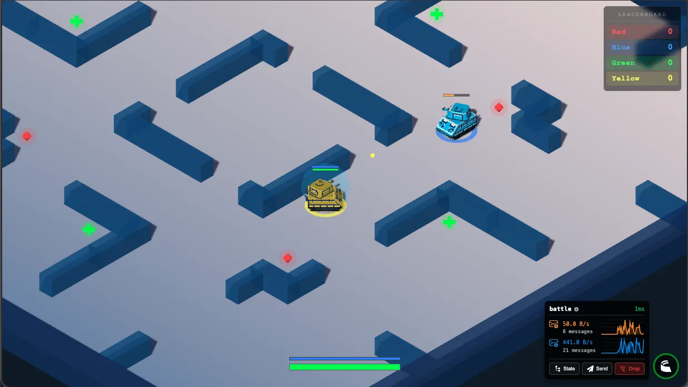
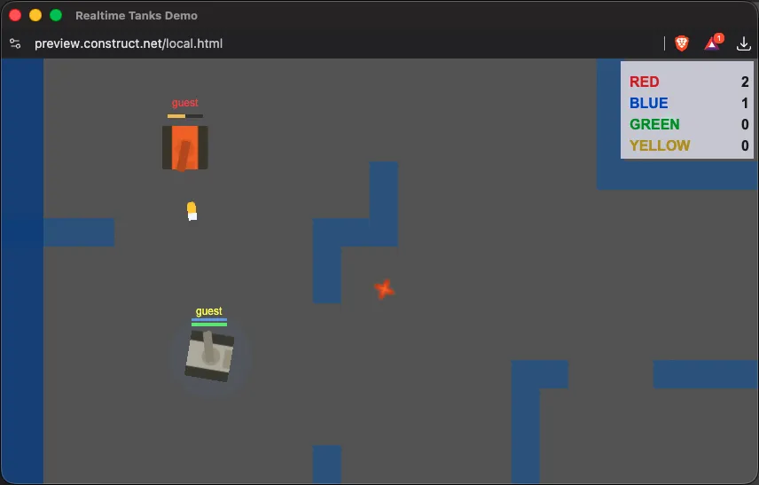

# Demo: Realtime Tanks Multiplayer

A multiplayer tank battle game built with [Colyseus](https://colyseus.io/). Multiple frontend implementations share the same authoritative game server.

> Inspired by the [Tanx](http://playcanv.as/p/aP0oxhUr) from [PlayCanvas](https://playcanvas.com/), by [Max M](https://github.com/Maksims) - Original server sources: [cvan/tanx-1](https://github.com/cvan/tanx-1).

## Project Structure

The `server/` directory contains the shared game server powered by Colyseus 0.17.

| Client | Directory | Rendering | Platforms | Assets | Screenshot |
|---|---|---|---|---|---|
| PlayCanvas | [`web-playcanvas/`](web-playcanvas/) | 3D | Web | [Pixel Tank](https://sketchfab.com/3d-models/pixel-tank-d04bf57ee1ae4504856032549bcfd810) by [Firewarden3D](https://sketchfab.com/Firewarden) |  |
| GameMaker | [`gamemaker/`](gamemaker/) | 2D | Windows, macOS, Linux, HTML5 | [Kenney Top-Down Tanks](https://kenney.nl/assets/top-down-tanks-redux) (CC0) |  |
| Godot | [`godot/`](godot/) | 3D | Windows, macOS, Linux, HTML5, iOS, Android | Procedural meshes |  |
| Defold | [`defold/`](defold/) | 2D | Windows, macOS, Linux, HTML5, iOS, Android | [Kenney Top-Down Tanks](https://kenney.nl/assets/top-down-tanks-redux) (CC0) |  |
| Haxe + Heaps | [`haxe/`](haxe/) | 3D | Web, Native (HL/C) | Procedural meshes |  |
| Unity | [`unity/`](unity/) | 3D | Windows, macOS, Linux, WebGL, iOS, Android | Procedural primitives |  |
| Three.js | [`web-threejs/`](web-threejs/) | 3D | Web | [Pixel Tank](https://sketchfab.com/3d-models/pixel-tank-d04bf57ee1ae4504856032549bcfd810) by [Firewarden3D](https://sketchfab.com/Firewarden) |  |
| Construct 3 | [`construct3/`](construct3/) | 2D | Web | [Kenney Top-Down Tanks](https://kenney.nl/assets/top-down-tanks-redux) (CC0) |  |

## Getting Started

Start the server:

```bash
cd server && npm install
npm run dev
```

See each client's README for setup instructions.

## License

MIT — See [LICENSE](LICENSE) file.
