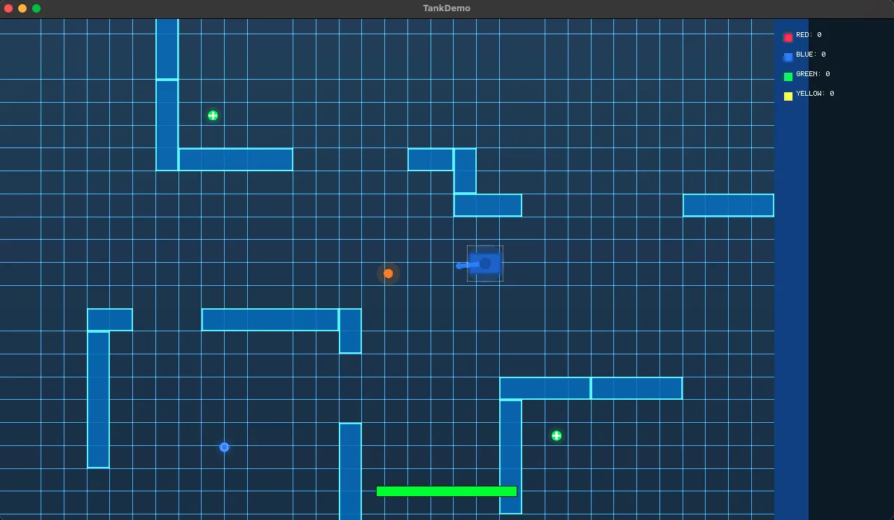

# MonoGame Client — Realtime Tanks Demo

A 2D top-down MonoGame client for the Realtime Tanks multiplayer demo, powered by [Colyseus](https://colyseus.io/).



## Requirements

- [.NET 10 SDK](https://dotnet.microsoft.com/download)
- The shared game server running on `ws://localhost:2567`

## Running

1. Start the server (from the repo root):

```bash
cd server && npm install
npm run dev
```

2. Run the MonoGame client:

```bash
dotnet run
```

## Controls

| Input | Action |
|---|---|
| WASD / Arrow keys | Move tank |
| Mouse | Aim turret |
| Left click | Shoot |
| ESC | Quit |

## Tech Stack

- **MonoGame 3.8.2** (DesktopGL) — cross-platform 2D rendering
- **Colyseus.MonoGame 0.17.11** — multiplayer networking + state synchronization
- **Schema codegen** — C# state classes auto-generated from the server schema

## Project Structure

```
monogame/
├── TankDemo.csproj       # Project file
├── Program.cs            # Entry point
├── TankGame.cs           # Game loop, rendering, input, networking
└── Schema/               # Auto-generated from server schema
    ├── BattleState.cs
    ├── TankState.cs
    ├── BulletState.cs
    ├── PickableState.cs
    └── TeamState.cs
```
